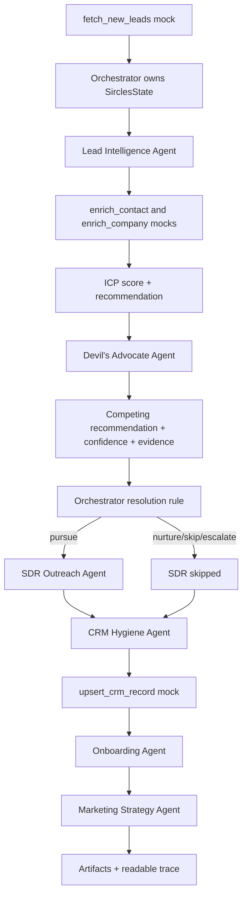

# Sircles AI Agentic Lead Pipeline

Debate-first multi-agent system for the inbound-lead-to-first-touch workflow.

## Quickstart

```bash
pip install -r requirements.txt
python main.py
```

Useful commands:

```bash
python main.py --lead 0
python main.py --lead 2 --trace-only
python -m pytest tests/ -v
```

No API keys are required. All enrichment, CRM, onboarding, and marketing inputs are mock fixtures.

## Architecture



The orchestrator is the team lead. It initializes shared state, runs every handoff, applies the debate rule, and records the final trace.

## Agents

| Agent | Responsibility | Output |
| --- | --- | --- |
| Lead Intelligence | Enriches contact/company, scores ICP, proposes pursue/nurture/skip | `AgentPosition` |
| Devil's Advocate | Reviews the same data from a skeptical risk lens | `AgentPosition` |
| SDR Outreach | Drafts personalized email and LinkedIn note when disposition is pursue | `OutreachDraft` |
| CRM Hygiene | Writes structured mock HubSpot record and flags review needs | `CRMRecord` |
| Onboarding | Prepares client-system setup when pursuit is approved, or records blockers | `OnboardingRecord` |
| Marketing Strategy | Builds competitor, content, visual, and communication brief from mock Sircles playbook | `MarketingBrief` |

## Debate Design

The debate is a Propose / Challenge / Resolve loop:

1. Lead Intelligence proposes a disposition with confidence and evidence.
2. Devil's Advocate independently challenges using the same enriched state.
3. The orchestrator applies the documented resolution rule.

Resolution rule:

| Condition | Outcome |
| --- | --- |
| Agents agree | Consensus recommendation wins; both positions remain recorded |
| Agents disagree and confidence gap >= 0.12 | Higher confidence wins |
| Agents disagree and confidence gap < 0.12 | Escalate for human review |
| Highest confidence < 0.45 | Escalate for human review |

Dissent is recorded in the trace. For escalations, no automated winner is forced; both unresolved positions are preserved and the CRM record is flagged.

## Mock Tools

All tools live in `tools/mock_tools.py`.

| Tool | Mock source |
| --- | --- |
| `fetch_new_leads()` | Lead scanner fixture |
| `enrich_contact()` | Apollo/Clay contact fixture |
| `enrich_company()` | Apollo/Clay company fixture |
| `upsert_crm_record()` | HubSpot upsert fixture |
| `provision_onboarding_workspace()` | Sircles systems provisioning fixture |
| `fetch_sircles_marketing_playbook()` | Historical campaign/model fixture |

## Sample Leads

| Label | Email | Purpose |
| --- | --- | --- |
| `clear_pursue` | alex.chen@growthsaas.io | Strong ICP fit; produces SDR outreach and onboarding setup |
| `clear_skip` | sara.malik@solofrelancer.dev | Solo operator; no outreach |
| `ambiguous_competitor` | james.obi@nexusagency.co | Strong fit but direct competitor; triggers debate and escalation |
| `escalation_case` | priya.nair@ambiguouscorp.com | Borderline confidence gap; triggers human review |

## Traces

Running `python main.py` writes trace files to `traces/`. Each trace includes:

- agent recommendations, confidence, evidence, and reasoning
- resolution rule, winner/loser or unresolved escalation
- recorded dissent
- CRM record details and human-review flags
- onboarding record
- marketing strategy brief

The assignment asks for a clear case and an ambiguous case. Run:

```bash
python main.py --lead 0
python main.py --lead 2
```

## Tests

```bash
python -m pytest tests/ -v
```

Coverage focuses on the highest-value contract points:

- resolution rule consensus, confidence-weighted winner, dissent, and escalation
- Lead Intelligence agent output contract
- competitor case disagreement
- end-to-end CRM/outreach behavior
- structured Onboarding and Marketing Strategy artifacts

## Design Decisions

- The system uses deterministic Python logic rather than live LLM calls so it is reproducible in an interview.
- Shared state is a `TypedDict` plus dataclasses; this keeps handoffs explicit without adding a framework.
- CRM always runs, even for skipped or escalated leads, because disqualification and review flags are useful CRM facts.
- Onboarding prepares setup only for pursue outcomes and records blockers otherwise.
- Marketing Strategy always produces a brief so downstream teams can see whether to pursue, suppress, nurture, or hold for review.
